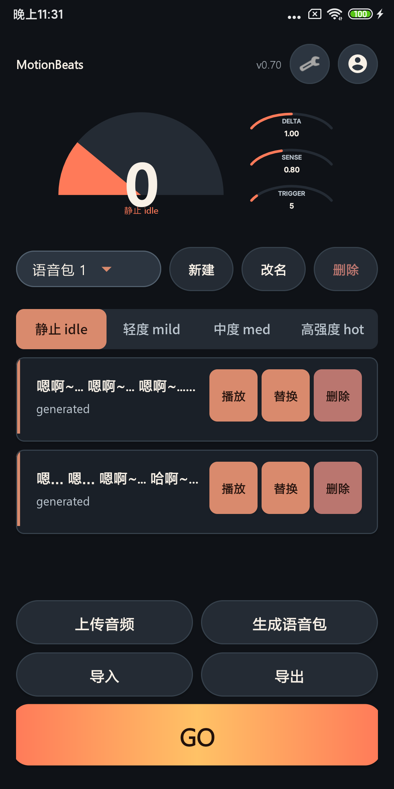
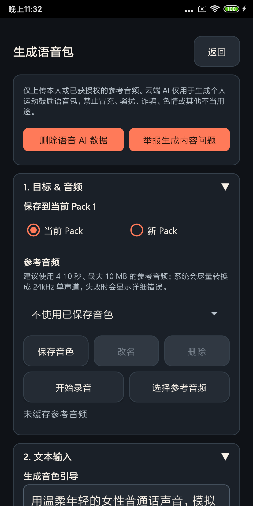
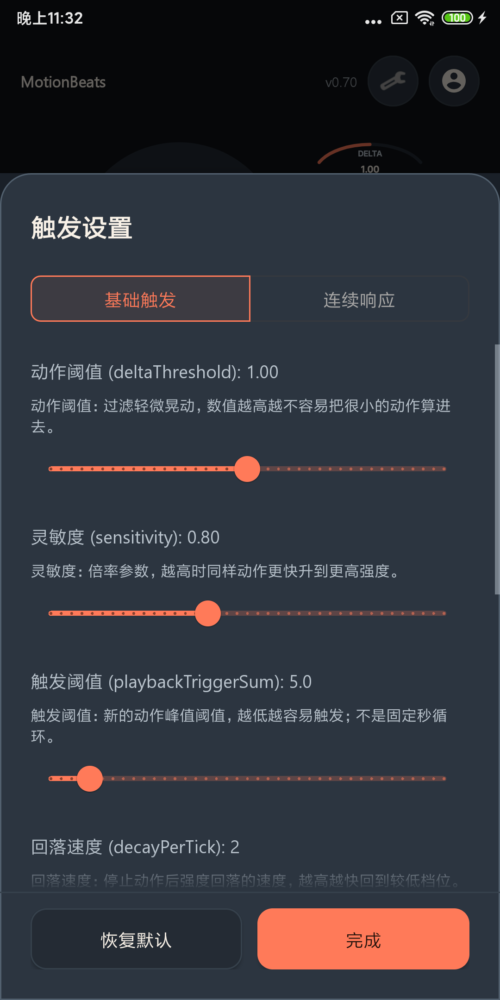

# MotionBeats

MotionBeats is a motion-triggered voice feedback app for Android and iOS beta testing.

You tap `GO`, move your phone, and the app plays audio from the current voice pack according to motion intensity. It is designed for quick feedback, custom voice packs, and early testing of cloud-assisted voice generation.

This public repository is for product updates, releases, bug reports, and feature suggestions only. The application source code and internal development documents are not published here.

## Download

- Android test builds will be published in [Releases](../../releases).
- iOS testing is handled through the current beta channel when available.
- Cloud voice generation may require a DuelX.ai account: [https://duelx.ai](https://duelx.ai)

If there is no release yet, please watch this repository or open an issue asking for the latest beta channel.

## What It Does

- Motion intensity controls which voice line is played.
- Four slots are supported: `IDLE`, `MILD`, `MED`, and `HOT`.
- Voice packs can be imported, exported, edited, and tested.
- Local audio files can be added to a pack.
- Cloud generation can create voice lines from built-in voices or a short reference audio sample.
- Trigger settings can be tuned for sensitivity, cooldown, idle playback, and continuous response.

## Supported Languages

MotionBeats currently supports app UI and built-in content in:

- English
- 繁體中文
- 日本語
- 한국어

## Quick Start

1. Install the latest beta build from [Releases](../../releases).
2. Open MotionBeats.
3. Add at least one audio line by uploading local audio or generating one after login.
4. Pick the target slot, for example `MILD`.
5. Tap `GO`.
6. Move the phone and watch the intensity slot change.
7. Stop listening when you are done.

New installs may contain an empty default pack. If you press `GO` and hear nothing, first check whether the current slot has playable audio.

## Screenshots

These screenshots are beta UI previews. Exact wording, layout, and version text may differ from the latest build.







## Voice Pack ZIP Format

Recommended format:

```text
pack-name.zip
  entries.json
  audio/
    line-1.wav
    line-2.mp3
    line-3.m4a
```

Legacy filename format is also supported:

```text
idle_01.wav
mild_01.mp3
med_01.wav
hot_01.m4a
```

Supported audio extensions include `.wav`, `.mp3`, and `.m4a`.

## Feedback

Please use GitHub Issues:

- [Report a bug](../../issues/new?template=bug_report.yml)
- [Suggest a feature](../../issues/new?template=feature_request.yml)
- [Ask a question](../../issues/new)

When reporting a bug, include:

- App version
- Device model
- Android or iOS version
- Steps to reproduce
- Screenshot or screen recording if possible
- The exact error message shown in the app

Please do not post passwords, private tokens, reference audio that you do not have permission to share, or other sensitive information.

## Privacy And Safety

Only upload audio that you have the right to use. Cloud generation requires network access and may process the text or audio you submit for generation. Do not upload private, illegal, or non-consensual material.

This repository is public. Anything posted in issues or discussions can be seen by other people.

## Repository Scope

This public repository intentionally does not include:

- Application source code
- Build scripts
- Internal design documents
- Provider keys, service credentials, or private backend details
- Development task plans

For product feedback, this keeps the public surface clean while allowing users to follow releases and file issues.
