# MotionBeats

[English](#english) | [简体中文](#zh-hans) | [繁體中文](#zh-hant) | [日本語](#ja) | [한국어](#ko) | [Français](#fr) | [Deutsch](#de) | [Español](#es) | [Português](#pt) | [Русский](#ru)

<a id="english"></a>

## English

MotionBeats is a motion-triggered voice feedback app for Android and iOS beta testing.

You tap `GO`, move your phone, and the app plays audio from the current voice pack according to motion intensity. It is designed for quick feedback, custom voice packs, and early testing of cloud-assisted voice generation.

This public repository is for product updates, releases, bug reports, and feature suggestions only. The application source code and internal development documents are not published here.

### Documentation Note

This homepage README is maintained in multiple languages. Each language section describes the same public product information, release channel, feedback rules, privacy reminders, and repository scope.

### Download

- Android test builds will be published in [Releases](../../releases).
- iOS testing is handled through the current beta channel when available.
- Cloud voice generation may require a DuelX.ai account: [https://duelx.ai](https://duelx.ai)

If there is no release yet, please watch this repository or open an issue asking for the latest beta channel.

### What It Does

- Motion intensity controls which voice line is played.
- Four slots are supported: `IDLE`, `MILD`, `MED`, and `HOT`.
- Voice packs can be imported, exported, edited, and tested.
- Local audio files can be added to a pack.
- Cloud generation can create voice lines from built-in voices or a short reference audio sample.
- Trigger settings can be tuned for sensitivity, cooldown, idle playback, and continuous response.

### Supported Languages

MotionBeats currently supports app UI and built-in content in:

- English
- 简体中文
- 繁體中文
- 日本語
- 한국어
- Français
- Deutsch
- Español
- Português
- Русский

### Quick Start

1. Install the latest beta build from [Releases](../../releases).
2. Open MotionBeats.
3. Add at least one audio line by uploading local audio or generating one after login.
4. Pick the target slot, for example `MILD`.
5. Tap `GO`.
6. Move the phone and watch the intensity slot change.
7. Stop listening when you are done.

New installs may contain an empty default pack. If you press `GO` and hear nothing, first check whether the current slot has playable audio.

### Screenshots

These English screenshots were captured from the Android beta app. Exact layout and version text may differ from the latest build.


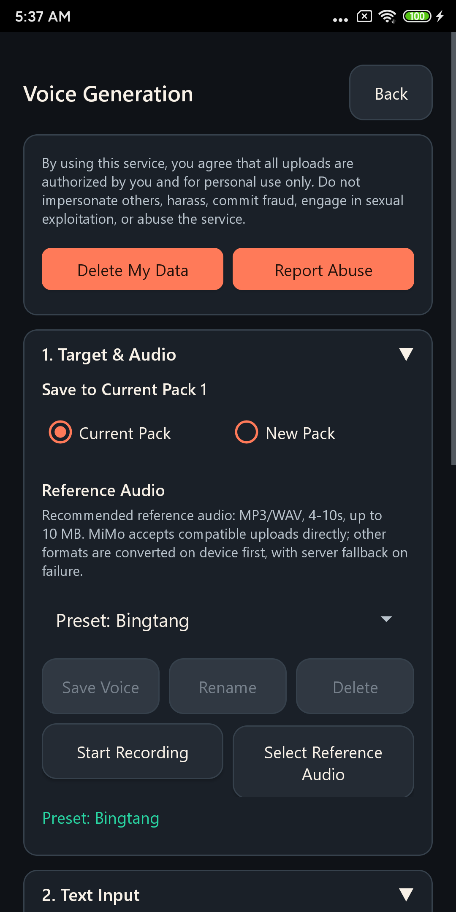

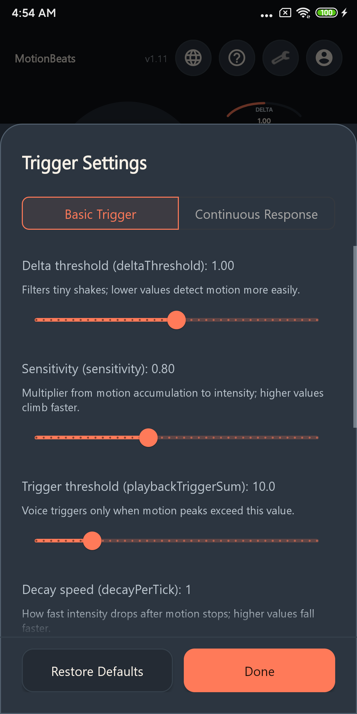

### Voice Pack ZIP Format

Recommended format:

```text
pack-name.zip
  entries.json
  audio/
    line-1.wav
    line-2.mp3
    line-3.m4a
```

Legacy filename format is also supported:

```text
idle_01.wav
mild_01.mp3
med_01.wav
hot_01.m4a
```

Supported audio extensions include `.wav`, `.mp3`, and `.m4a`.

### Feedback

Please use GitHub Issues:

- [Report a bug](../../issues/new?template=bug_report.yml)
- [Suggest a feature](../../issues/new?template=feature_request.yml)
- [Ask a question](../../issues/new)

When reporting a bug, include:

- App version
- Device model
- Android or iOS version
- Steps to reproduce
- Screenshot or screen recording if possible
- The exact error message shown in the app

Please do not post passwords, private tokens, reference audio that you do not have permission to share, or other sensitive information.

### Privacy And Safety

Only upload audio that you have the right to use. Cloud generation requires network access and may process the text or audio you submit for generation. Do not upload private, illegal, or non-consensual material.

This repository is public. Anything posted in issues or discussions can be seen by other people.

### Repository Scope

This public repository intentionally does not include:

- Application source code
- Build scripts
- Internal design documents
- Provider keys, service credentials, or private backend details
- Development task plans

For product feedback, this keeps the public surface clean while allowing users to follow releases and file issues.

[Back to top](#motionbeats)

<a id="zh-hans"></a>

## 简体中文

MotionBeats 是一款用于 Android 和 iOS beta 测试的动作触发语音反馈 App。

点击 `GO`，移动手机，App 会根据动作强度从当前语音包播放对应语音。它适合即时反馈、自定义语音包，以及云端辅助语音生成的早期测试。

这个公开仓库只用于产品更新、版本发布、Bug 反馈和功能建议。App 源码和内部开发文档不会在这里公开。

### 文档说明

这个首页 README 提供多语言版本。每个语言区都说明同一份公开产品信息、发布渠道、反馈规则、隐私提醒和仓库范围。

### 下载

- Android 测试版会发布在 [Releases](../../releases)。
- iOS 测试会在可用时通过当前 beta 测试渠道进行。
- 云端语音生成可能需要 DuelX.ai 账号：[https://duelx.ai](https://duelx.ai)

如果目前还没有发布版本，可以关注这个仓库，或者开 issue 询问最新 beta 渠道。

### 功能

- 动作强度会控制播放哪一条语音。
- 支持四个档位：`IDLE`、`MILD`、`MED`、`HOT`。
- 语音包可以导入、导出、编辑和测试。
- 可以把本地音频文件加入语音包。
- 云端生成可以使用内置音色或一段短参考音频创建语音条目。
- 触发设置可以调整灵敏度、冷却、空闲播放和连续响应。

### 支持语言

MotionBeats 目前支持以下 App 界面与内置内容语言：

- English
- 简体中文
- 繁體中文
- 日本語
- 한국어
- Français
- Deutsch
- Español
- Português
- Русский

### 快速开始

1. 从 [Releases](../../releases) 安装最新 beta 版本。
2. 打开 MotionBeats。
3. 通过上传本地音频，或登录后生成语音，先加入至少一条语音。
4. 选择目标档位，例如 `MILD`。
5. 点击 `GO`。
6. 移动手机，观察强度档位变化。
7. 不需要继续监听时停止。

新安装时可能只有空的默认语音包。如果按下 `GO` 后没有声音，请先确认当前档位是否有可播放音频。

### 截图

以下简体中文截图来自 Android beta App。实际布局和版本文字可能会随最新 build 变化。

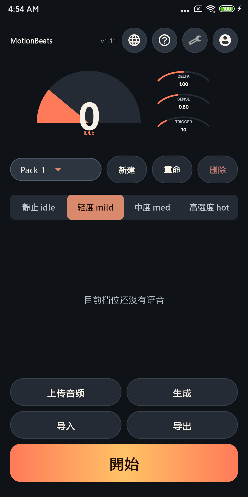

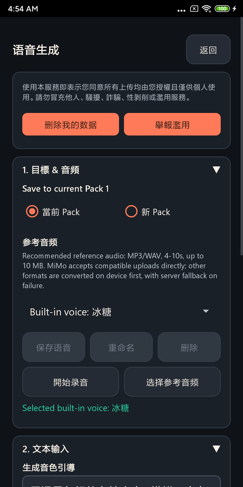

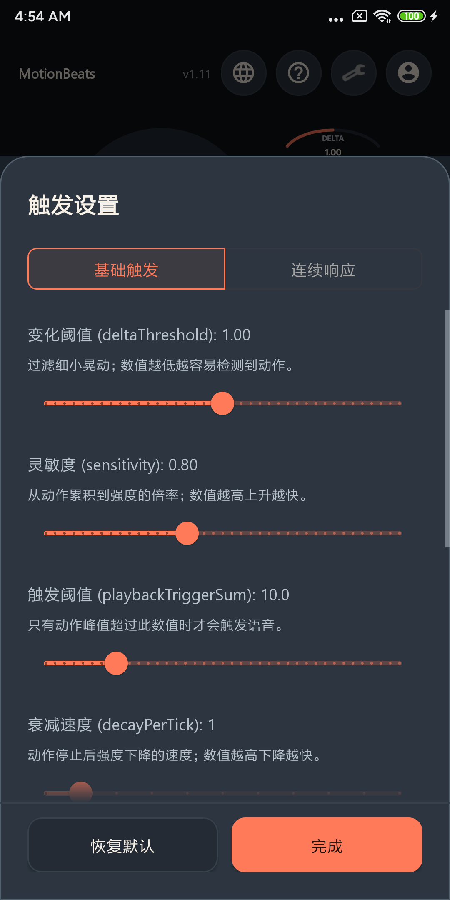

### 语音包 ZIP 格式

推荐格式：

```text
pack-name.zip
  entries.json
  audio/
    line-1.wav
    line-2.mp3
    line-3.m4a
```

也支持旧文件名格式：

```text
idle_01.wav
mild_01.mp3
med_01.wav
hot_01.m4a
```

支持的音频扩展名包括 `.wav`、`.mp3` 和 `.m4a`。

### 反馈

请使用 GitHub Issues：

- [反馈 Bug](../../issues/new?template=bug_report.yml)
- [提出功能建议](../../issues/new?template=feature_request.yml)
- [提问](../../issues/new)

反馈 Bug 时请提供：

- App 版本
- 设备型号
- Android 或 iOS 版本
- 复现步骤
- 如果可以，请附上截图或录屏
- App 显示的完整错误信息

请不要公开密码、私人 token、未获授权的参考音频，或其他敏感信息。

### 隐私与安全

请只上传你有权使用的音频。云端生成需要网络连接，并可能处理你提交用于生成的文字或音频。请不要上传私人、非法或未经同意的内容。

这个仓库是公开的。任何发在 issues 或 discussions 的内容都可能被其他人看到。

### 仓库范围

这个公开仓库不包含：

- App 源码
- 构建脚本
- 内部设计文档
- Provider key、服务凭证或私人后端细节
- 开发任务计划

这样可以让产品反馈入口保持干净，同时让用户追踪版本并提交问题。

[回到顶部](#motionbeats)

<a id="zh-hant"></a>

## 繁體中文

MotionBeats 是一款支援 Android 與 iOS beta 測試的動作觸發語音回饋 App。

點一下 `GO`，移動手機，App 會依照動作強度從目前語音包播放對應語音。它適合即時回饋、自訂語音包，以及雲端輔助語音生成的早期測試。

這個公開倉庫只用於產品更新、版本發布、Bug 回報和功能建議。App 原始碼與內部開發文件不會在這裡公開。

### 文件說明

這個首頁 README 提供多語言版本。每個語言區都說明同一份公開產品資訊、發布渠道、回饋規則、隱私提醒和倉庫範圍。

### 下載

- Android 測試版會發布在 [Releases](../../releases)。
- iOS 測試會在可用時透過目前的 beta 測試渠道進行。
- 雲端語音生成可能需要 DuelX.ai 帳號：[https://duelx.ai](https://duelx.ai)

如果目前還沒有發布版本，請關注這個倉庫，或開 issue 詢問最新 beta 渠道。

### 功能

- 動作強度會控制播放哪一條語音。
- 支援四個檔位：`IDLE`、`MILD`、`MED`、`HOT`。
- 語音包可以匯入、匯出、編輯和測試。
- 可以把本機音訊加入語音包。
- 雲端生成可以使用內建音色或短參考音訊建立語音條目。
- 觸發設定可以調整靈敏度、冷卻、空閒播放和連續回應。

### 支援語言

MotionBeats 目前支援以下 App 介面與內建內容語言：

- English
- 简体中文
- 繁體中文
- 日本語
- 한국어
- Français
- Deutsch
- Español
- Português
- Русский

### 快速開始

1. 從 [Releases](../../releases) 安裝最新 beta 版本。
2. 打開 MotionBeats。
3. 透過上傳本機音訊，或登入後生成語音，先加入至少一條語音。
4. 選擇目標檔位，例如 `MILD`。
5. 點擊 `GO`。
6. 移動手機，觀察強度檔位變化。
7. 不需要繼續監聽時停止。

新安裝時可能只有空的預設語音包。如果按下 `GO` 後沒有聲音，請先確認目前檔位是否有可播放音訊。

### 截圖

以下繁體中文截圖來自 Android beta App。實際版面和版本文字可能會依最新 build 有所不同。

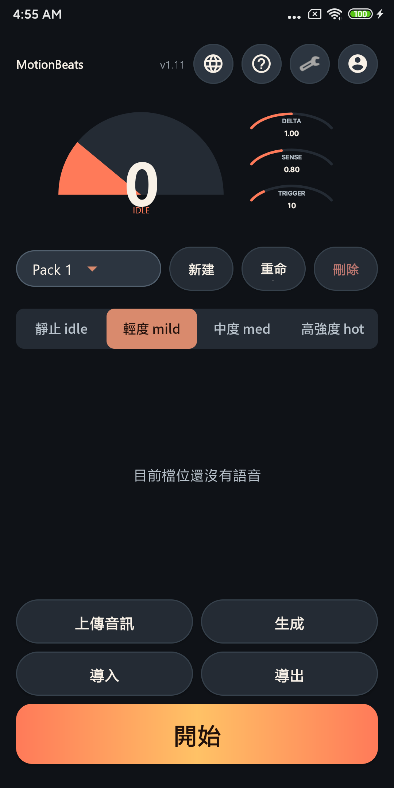

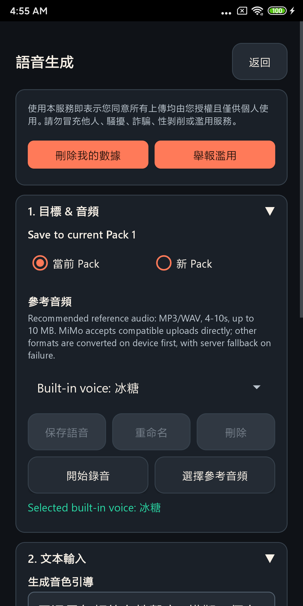

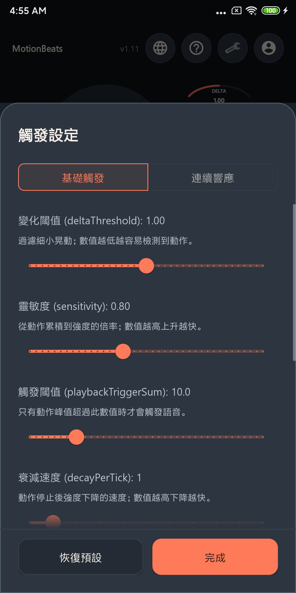

### 語音包 ZIP 格式

建議格式：

```text
pack-name.zip
  entries.json
  audio/
    line-1.wav
    line-2.mp3
    line-3.m4a
```

也支援舊檔名格式：

```text
idle_01.wav
mild_01.mp3
med_01.wav
hot_01.m4a
```

支援的音訊副檔名包含 `.wav`、`.mp3` 和 `.m4a`。

### 回饋

請使用 GitHub Issues：

- [回報 Bug](../../issues/new?template=bug_report.yml)
- [提出功能建議](../../issues/new?template=feature_request.yml)
- [提出問題](../../issues/new)

回報 Bug 時請提供：

- App 版本
- 裝置型號
- Android 或 iOS 版本
- 重現步驟
- 如果可以，請附上截圖或錄影
- App 顯示的完整錯誤訊息

請不要公開密碼、私人 token、未獲授權的參考音訊，或其他敏感資訊。

### 隱私與安全

請只上傳你有權使用的音訊。雲端生成需要網路連線，並可能處理你提交用於生成的文字或音訊。請不要上傳私人、非法或未經同意的內容。

這個倉庫是公開的。任何發在 issues 或 discussions 的內容都可能被其他人看到。

### 倉庫範圍

這個公開倉庫不包含：

- App 原始碼
- 建置腳本
- 內部設計文件
- Provider key、服務憑證或私人後端細節
- 開發任務計畫

這樣可以讓產品回饋入口保持乾淨，同時讓使用者追蹤版本並提交問題。

[回到頂端](#motionbeats)

<a id="ja"></a>

## 日本語

MotionBeats は、Android と iOS の beta テスト向けの、動きに反応する音声フィードバックアプリです。

`GO` をタップしてスマートフォンを動かすと、現在のボイスパックから動きの強さに応じた音声が再生されます。すばやいフィードバック、カスタムボイスパック、クラウド音声生成の初期テストを想定しています。

この公開リポジトリは、製品アップデート、リリース、不具合報告、機能提案のための場所です。アプリのソースコードと内部開発ドキュメントは公開していません。

### ドキュメントについて

このホームページ README は複数の言語で管理されています。各言語セクションには、同じ公開製品情報、リリースチャネル、フィードバックルール、プライバシー上の注意、リポジトリの範囲を記載しています。

### ダウンロード

- Android テストビルドは [Releases](../../releases) に公開されます。
- iOS テストは、利用可能な beta チャネルで案内されます。
- クラウド音声生成には DuelX.ai アカウントが必要な場合があります：[https://duelx.ai](https://duelx.ai)

まだリリースがない場合は、このリポジトリをウォッチするか、issue で最新 beta チャネルをお問い合わせください。

### 主な機能

- 動きの強さに応じて再生される音声が変わります。
- `IDLE`、`MILD`、`MED`、`HOT` の 4 つのスロットに対応しています。
- ボイスパックのインポート、エクスポート、編集、テストができます。
- ローカル音声ファイルをボイスパックに追加できます。
- クラウド生成では、内蔵ボイスまたは短い参照音声から音声ラインを作成できます。
- 感度、クールダウン、アイドル再生、連続応答などのトリガー設定を調整できます。

### 対応言語

MotionBeats は現在、アプリ UI と内蔵コンテンツで以下の言語に対応しています：

- English
- 简体中文
- 繁體中文
- 日本語
- 한국어
- Français
- Deutsch
- Español
- Português
- Русский

### クイックスタート

1. [Releases](../../releases) から最新の beta ビルドをインストールします。
2. MotionBeats を開きます。
3. ローカル音声のアップロード、またはログイン後の音声生成で、少なくとも 1 つの音声ラインを追加します。
4. `MILD` などの対象スロットを選びます。
5. `GO` をタップします。
6. スマートフォンを動かし、強度スロットの変化を確認します。
7. 終了したいときはリスニングを停止します。

新規インストール直後は、空のデフォルトパックだけがある場合があります。`GO` を押しても音が出ない場合は、まず現在のスロットに再生可能な音声があるか確認してください。

### スクリーンショット

以下の日本語スクリーンショットは Android beta アプリから取得したものです。実際のレイアウトやバージョン表示は最新ビルドと異なる場合があります。


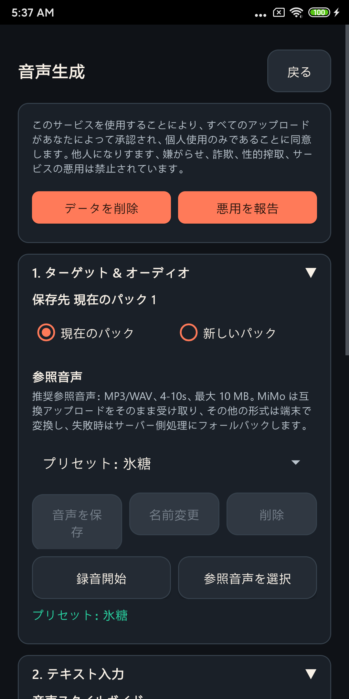

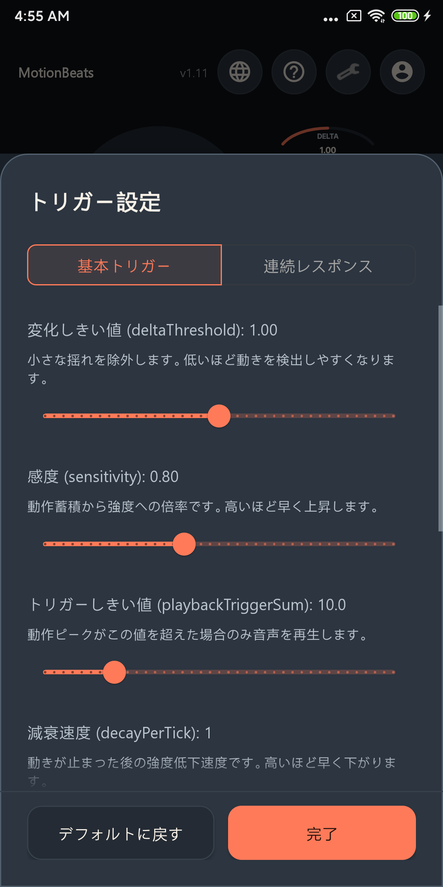

### ボイスパック ZIP 形式

推奨形式：

```text
pack-name.zip
  entries.json
  audio/
    line-1.wav
    line-2.mp3
    line-3.m4a
```

従来のファイル名形式にも対応しています：

```text
idle_01.wav
mild_01.mp3
med_01.wav
hot_01.m4a
```

対応する音声拡張子は `.wav`、`.mp3`、`.m4a` です。

### フィードバック

GitHub Issues を使用してください：

- [不具合を報告](../../issues/new?template=bug_report.yml)
- [機能を提案](../../issues/new?template=feature_request.yml)
- [質問する](../../issues/new)

不具合報告には以下を含めてください：

- App バージョン
- 端末モデル
- Android または iOS のバージョン
- 再現手順
- 可能であればスクリーンショットまたは画面録画
- アプリに表示された正確なエラーメッセージ

パスワード、個人用 token、共有する権利のない参照音声、その他の機密情報は投稿しないでください。

### プライバシーと安全

使用する権利のある音声だけをアップロードしてください。クラウド生成にはネットワーク接続が必要で、生成のために送信されたテキストや音声が処理される場合があります。個人的、違法、または同意のない素材はアップロードしないでください。

このリポジトリは公開されています。issues や discussions に投稿した内容は、他の人にも見える可能性があります。

### リポジトリの範囲

この公開リポジトリには以下は含まれません：

- アプリケーションのソースコード
- ビルドスクリプト
- 内部設計ドキュメント
- Provider key、サービス認証情報、非公開バックエンドの詳細
- 開発タスク計画

製品フィードバックの入口を整理しながら、ユーザーがリリースを追跡し、issue を投稿できるようにするためです。

[トップへ戻る](#motionbeats)

<a id="ko"></a>

## 한국어

MotionBeats는 Android 및 iOS beta 테스트를 위한 동작 기반 음성 피드백 앱입니다.

`GO`를 누르고 휴대폰을 움직이면, 앱이 현재 보이스 팩에서 동작 강도에 맞는 음성을 재생합니다. 빠른 피드백, 커스텀 보이스 팩, 클라우드 기반 음성 생성의 초기 테스트를 위해 설계되었습니다.

이 공개 저장소는 제품 업데이트, 릴리스, 버그 제보, 기능 제안을 위한 공간입니다. 앱 소스 코드와 내부 개발 문서는 공개하지 않습니다.

### 문서 안내

이 홈페이지 README는 여러 언어로 관리됩니다. 각 언어 섹션은 동일한 공개 제품 정보, 릴리스 채널, 피드백 규칙, 개인정보 안내, 저장소 범위를 설명합니다.

### 다운로드

- Android 테스트 빌드는 [Releases](../../releases)에 게시됩니다.
- iOS 테스트는 사용 가능한 beta 채널을 통해 진행됩니다.
- 클라우드 음성 생성에는 DuelX.ai 계정이 필요할 수 있습니다: [https://duelx.ai](https://duelx.ai)

아직 릴리스가 없다면 이 저장소를 watch 하거나 issue를 열어 최신 beta 채널을 문의해 주세요.

### 주요 기능

- 동작 강도에 따라 재생되는 음성이 달라집니다.
- `IDLE`, `MILD`, `MED`, `HOT` 네 가지 슬롯을 지원합니다.
- 보이스 팩을 가져오기, 내보내기, 편집, 테스트할 수 있습니다.
- 로컬 오디오 파일을 보이스 팩에 추가할 수 있습니다.
- 클라우드 생성으로 내장 보이스 또는 짧은 참조 오디오 샘플에서 음성 라인을 만들 수 있습니다.
- 민감도, 쿨다운, 대기 재생, 연속 반응 등 트리거 설정을 조정할 수 있습니다.

### 지원 언어

MotionBeats는 현재 앱 UI와 내장 콘텐츠에서 다음 언어를 지원합니다:

- English
- 简体中文
- 繁體中文
- 日本語
- 한국어
- Français
- Deutsch
- Español
- Português
- Русский

### 빠른 시작

1. [Releases](../../releases)에서 최신 beta 빌드를 설치합니다.
2. MotionBeats를 엽니다.
3. 로컬 오디오를 업로드하거나 로그인 후 음성을 생성해 최소 한 개의 음성 라인을 추가합니다.
4. 예를 들어 `MILD` 같은 대상 슬롯을 선택합니다.
5. `GO`를 누릅니다.
6. 휴대폰을 움직이며 강도 슬롯 변화를 확인합니다.
7. 더 이상 감지하지 않을 때는 중지합니다.

새로 설치한 경우 빈 기본 팩만 있을 수 있습니다. `GO`를 눌러도 소리가 나지 않으면 먼저 현재 슬롯에 재생 가능한 오디오가 있는지 확인해 주세요.

### 스크린샷

아래 한국어 스크린샷은 Android beta 앱에서 캡처한 것입니다. 실제 레이아웃과 버전 표시는 최신 빌드와 다를 수 있습니다.


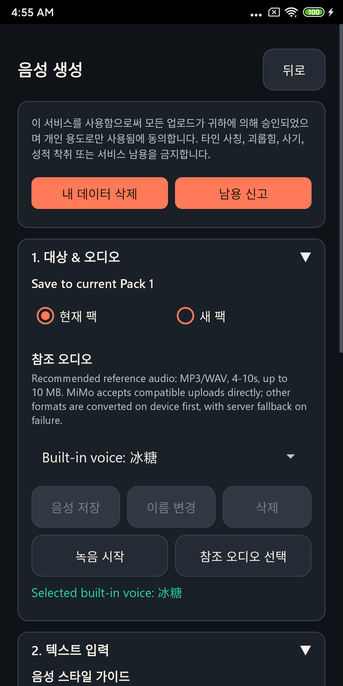

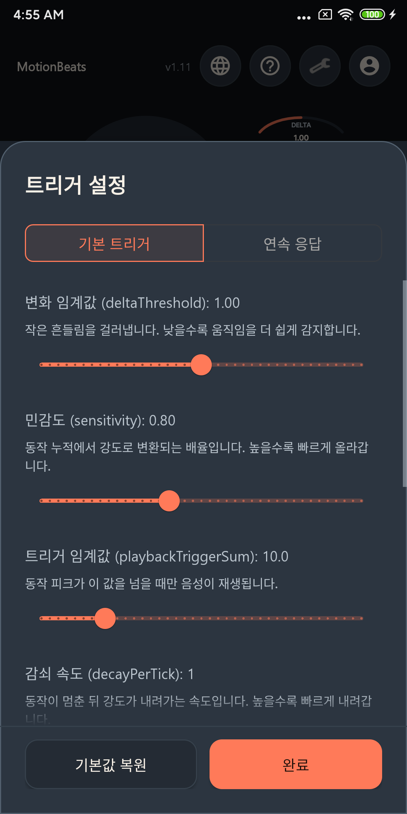

### 보이스 팩 ZIP 형식

권장 형식:

```text
pack-name.zip
  entries.json
  audio/
    line-1.wav
    line-2.mp3
    line-3.m4a
```

기존 파일명 형식도 지원합니다:

```text
idle_01.wav
mild_01.mp3
med_01.wav
hot_01.m4a
```

지원되는 오디오 확장자는 `.wav`, `.mp3`, `.m4a`입니다.

### 피드백

GitHub Issues를 사용해 주세요:

- [버그 제보](../../issues/new?template=bug_report.yml)
- [기능 제안](../../issues/new?template=feature_request.yml)
- [질문하기](../../issues/new)

버그를 제보할 때는 다음 내용을 포함해 주세요:

- App 버전
- 기기 모델
- Android 또는 iOS 버전
- 재현 단계
- 가능하다면 스크린샷 또는 화면 녹화
- 앱에 표시된 정확한 오류 메시지

비밀번호, 개인 token, 공유 권한이 없는 참조 오디오, 기타 민감한 정보는 게시하지 마세요.

### 개인정보와 안전

사용할 권리가 있는 오디오만 업로드해 주세요. 클라우드 생성에는 네트워크 연결이 필요하며, 생성에 제출한 텍스트나 오디오가 처리될 수 있습니다. 개인적이거나 불법이거나 동의가 없는 자료는 업로드하지 마세요.

이 저장소는 공개되어 있습니다. issues 또는 discussions에 게시한 내용은 다른 사람도 볼 수 있습니다.

### 저장소 범위

이 공개 저장소에는 다음이 포함되지 않습니다:

- 애플리케이션 소스 코드
- 빌드 스크립트
- 내부 설계 문서
- Provider key, 서비스 자격 증명 또는 비공개 백엔드 세부 정보
- 개발 작업 계획

제품 피드백 표면을 깔끔하게 유지하면서, 사용자가 릴리스를 확인하고 issue를 제출할 수 있게 하기 위한 범위입니다.

[맨 위로](#motionbeats)

<a id="fr"></a>

## Français

MotionBeats est une application de retour vocal déclenché par le mouvement, disponible pour les tests beta Android et iOS.

Appuyez sur `GO`, bougez votre téléphone, et l'application lit l'audio du pack vocal actuel selon l'intensité du mouvement. Elle est conçue pour les retours rapides, les packs vocaux personnalisés et les premiers tests de génération vocale assistée par le cloud.

Ce dépôt public sert uniquement aux mises à jour produit, aux versions, aux rapports de bug et aux suggestions de fonctionnalités. Le code source de l'application et les documents internes de développement ne sont pas publiés ici.

### Note sur la documentation

Ce README d'accueil est maintenu en plusieurs langues. Chaque section présente les mêmes informations publiques sur le produit, le canal de publication, les règles de feedback, les rappels de confidentialité et le périmètre du dépôt.

### Téléchargement

- Les builds de test Android sont publiés dans [Releases](../../releases).
- Les tests iOS passent par le canal beta actuel lorsqu'il est disponible.
- La génération vocale cloud peut nécessiter un compte DuelX.ai : [https://duelx.ai](https://duelx.ai)

S'il n'y a pas encore de version publiée, suivez ce dépôt ou ouvrez une issue pour demander le dernier canal beta.

### Fonctionnalités

- L'intensité du mouvement contrôle la ligne vocale lue.
- Quatre emplacements sont pris en charge : `IDLE`, `MILD`, `MED` et `HOT`.
- Les packs vocaux peuvent être importés, exportés, modifiés et testés.
- Des fichiers audio locaux peuvent être ajoutés à un pack.
- La génération cloud peut créer des lignes vocales à partir de voix intégrées ou d'un court échantillon audio de référence.
- Les paramètres de déclenchement permettent d'ajuster la sensibilité, le délai de récupération, la lecture au repos et la réponse continue.

### Langues prises en charge

MotionBeats prend actuellement en charge l'interface de l'application et le contenu intégré dans les langues suivantes :

- English
- 简体中文
- 繁體中文
- 日本語
- 한국어
- Français
- Deutsch
- Español
- Português
- Русский

### Démarrage rapide

1. Installez le dernier build beta depuis [Releases](../../releases).
2. Ouvrez MotionBeats.
3. Ajoutez au moins une ligne audio en important un fichier local ou en générant une voix après connexion.
4. Choisissez l'emplacement cible, par exemple `MILD`.
5. Appuyez sur `GO`.
6. Bougez le téléphone et observez le changement d'intensité.
7. Arrêtez l'écoute quand vous avez terminé.

Une nouvelle installation peut contenir un pack par défaut vide. Si vous appuyez sur `GO` et n'entendez rien, vérifiez d'abord que l'emplacement actuel contient un audio lisible.

### Format ZIP des packs vocaux

Format recommandé :

```text
pack-name.zip
  entries.json
  audio/
    line-1.wav
    line-2.mp3
    line-3.m4a
```

L'ancien format de nom de fichier est également pris en charge :

```text
idle_01.wav
mild_01.mp3
med_01.wav
hot_01.m4a
```

Les extensions audio prises en charge incluent `.wav`, `.mp3` et `.m4a`.

### Feedback

Veuillez utiliser GitHub Issues :

- [Signaler un bug](../../issues/new?template=bug_report.yml)
- [Proposer une fonctionnalité](../../issues/new?template=feature_request.yml)
- [Poser une question](../../issues/new)

Pour signaler un bug, indiquez :

- Version de l'application
- Modèle de l'appareil
- Version Android ou iOS
- Étapes de reproduction
- Capture d'écran ou enregistrement vidéo si possible
- Message d'erreur exact affiché dans l'application

Ne publiez pas de mots de passe, tokens privés, audio de référence que vous n'êtes pas autorisé à partager, ni autres informations sensibles.

### Confidentialité et sécurité

N'importez que des audios que vous avez le droit d'utiliser. La génération cloud nécessite un accès réseau et peut traiter le texte ou l'audio que vous soumettez pour la génération. N'importez pas de contenu privé, illégal ou non consenti.

Ce dépôt est public. Tout contenu publié dans les issues ou discussions peut être vu par d'autres personnes.

### Périmètre du dépôt

Ce dépôt public n'inclut volontairement pas :

- Code source de l'application
- Scripts de build
- Documents internes de conception
- Clés de fournisseur, identifiants de service ou détails privés du backend
- Plans de tâches de développement

Cela garde l'espace de feedback produit propre tout en permettant aux utilisateurs de suivre les versions et de créer des issues.

[Retour en haut](#motionbeats)

<a id="de"></a>

## Deutsch

MotionBeats ist eine App für bewegungsgesteuertes Sprachfeedback für Android- und iOS-Betatests.

Tippen Sie auf `GO`, bewegen Sie Ihr Smartphone, und die App spielt Audio aus dem aktuellen Sprachpaket passend zur Bewegungsintensität ab. Sie ist für schnelles Feedback, eigene Sprachpakete und frühe Tests der cloudgestützten Sprachgenerierung gedacht.

Dieses öffentliche Repository dient nur Produktupdates, Releases, Fehlermeldungen und Funktionsvorschlägen. Der Quellcode der App und interne Entwicklungsdokumente werden hier nicht veröffentlicht.

### Hinweis zur Dokumentation

Dieses README auf der Startseite wird in mehreren Sprachen gepflegt. Jeder Sprachabschnitt beschreibt dieselben öffentlichen Produktinformationen, Release-Kanäle, Feedback-Regeln, Datenschutzhinweise und den Umfang des Repositorys.

### Download

- Android-Testbuilds werden unter [Releases](../../releases) veröffentlicht.
- iOS-Tests laufen über den aktuellen Betakanal, sofern verfügbar.
- Für die cloudbasierte Sprachgenerierung kann ein DuelX.ai-Konto erforderlich sein: [https://duelx.ai](https://duelx.ai)

Wenn es noch keinen Release gibt, beobachten Sie dieses Repository oder öffnen Sie eine Issue, um nach dem aktuellen Betakanal zu fragen.

### Funktionen

- Die Bewegungsintensität steuert, welche Sprachzeile abgespielt wird.
- Vier Slots werden unterstützt: `IDLE`, `MILD`, `MED` und `HOT`.
- Sprachpakete können importiert, exportiert, bearbeitet und getestet werden.
- Lokale Audiodateien können einem Paket hinzugefügt werden.
- Die Cloud-Generierung kann Sprachzeilen aus integrierten Stimmen oder einem kurzen Referenzaudio erstellen.
- Auslöseinstellungen lassen sich für Empfindlichkeit, Abklingzeit, Wiedergabe im Ruhezustand und kontinuierliche Reaktion anpassen.

### Unterstützte Sprachen

MotionBeats unterstützt derzeit die App-Oberfläche und integrierte Inhalte in:

- English
- 简体中文
- 繁體中文
- 日本語
- 한국어
- Français
- Deutsch
- Español
- Português
- Русский

### Schnellstart

1. Installieren Sie den neuesten Betabuild aus [Releases](../../releases).
2. Öffnen Sie MotionBeats.
3. Fügen Sie mindestens eine Audiozeile hinzu, indem Sie lokales Audio hochladen oder nach der Anmeldung eine Stimme generieren.
4. Wählen Sie den Zielslot, zum Beispiel `MILD`.
5. Tippen Sie auf `GO`.
6. Bewegen Sie das Smartphone und beobachten Sie den Wechsel des Intensitätsslots.
7. Beenden Sie die Erfassung, wenn Sie fertig sind.

Neue Installationen können ein leeres Standardpaket enthalten. Wenn Sie `GO` drücken und nichts hören, prüfen Sie zuerst, ob der aktuelle Slot abspielbares Audio enthält.

### ZIP-Format für Sprachpakete

Empfohlenes Format:

```text
pack-name.zip
  entries.json
  audio/
    line-1.wav
    line-2.mp3
    line-3.m4a
```

Das ältere Dateinamenformat wird ebenfalls unterstützt:

```text
idle_01.wav
mild_01.mp3
med_01.wav
hot_01.m4a
```

Unterstützte Audioerweiterungen sind `.wav`, `.mp3` und `.m4a`.

### Feedback

Bitte verwenden Sie GitHub Issues:

- [Fehler melden](../../issues/new?template=bug_report.yml)
- [Funktion vorschlagen](../../issues/new?template=feature_request.yml)
- [Frage stellen](../../issues/new)

Bitte geben Sie bei Fehlermeldungen Folgendes an:

- App-Version
- Gerätemodell
- Android- oder iOS-Version
- Schritte zur Reproduktion
- Screenshot oder Bildschirmaufnahme, wenn möglich
- Exakte Fehlermeldung aus der App

Veröffentlichen Sie keine Passwörter, privaten Tokens, Referenzaudios ohne entsprechende Rechte oder andere sensible Informationen.

### Datenschutz und Sicherheit

Laden Sie nur Audio hoch, das Sie verwenden dürfen. Die Cloud-Generierung benötigt Netzwerkzugriff und kann den Text oder das Audio verarbeiten, das Sie zur Generierung einreichen. Laden Sie keine privaten, illegalen oder nicht einvernehmlich bereitgestellten Inhalte hoch.

Dieses Repository ist öffentlich. Alles, was in Issues oder Discussions gepostet wird, kann von anderen Personen gesehen werden.

### Umfang des Repositorys

Dieses öffentliche Repository enthält bewusst nicht:

- Quellcode der Anwendung
- Build-Skripte
- Interne Designdokumente
- Provider-Keys, Service-Zugangsdaten oder private Backend-Details
- Entwicklungsaufgabenpläne

So bleibt die öffentliche Produktfeedback-Fläche übersichtlich, während Nutzer Releases verfolgen und Issues erstellen können.

[Zurück nach oben](#motionbeats)

<a id="es"></a>

## Español

MotionBeats es una app de respuesta de voz activada por movimiento para pruebas beta en Android e iOS.

Toca `GO`, mueve el teléfono y la app reproduce audio del paquete de voz actual según la intensidad del movimiento. Está pensada para feedback rápido, paquetes de voz personalizados y pruebas tempranas de generación de voz asistida por la nube.

Este repositorio público se usa solo para actualizaciones del producto, versiones, reportes de bugs y sugerencias de funciones. El código fuente de la app y la documentación interna de desarrollo no se publican aquí.

### Nota sobre la documentación

Este README de inicio se mantiene en varios idiomas. Cada sección describe la misma información pública del producto, canal de publicación, reglas de feedback, recordatorios de privacidad y alcance del repositorio.

### Descarga

- Las builds de prueba de Android se publican en [Releases](../../releases).
- Las pruebas de iOS se gestionan mediante el canal beta actual cuando está disponible.
- La generación de voz en la nube puede requerir una cuenta de DuelX.ai: [https://duelx.ai](https://duelx.ai)

Si todavía no hay una versión publicada, sigue este repositorio o abre una issue para preguntar por el canal beta más reciente.

### Qué hace

- La intensidad del movimiento controla qué línea de voz se reproduce.
- Se admiten cuatro slots: `IDLE`, `MILD`, `MED` y `HOT`.
- Los paquetes de voz se pueden importar, exportar, editar y probar.
- Se pueden añadir archivos de audio locales a un paquete.
- La generación en la nube puede crear líneas de voz desde voces integradas o una muestra corta de audio de referencia.
- Los ajustes de activación permiten configurar sensibilidad, tiempo de espera, reproducción en reposo y respuesta continua.

### Idiomas compatibles

MotionBeats admite actualmente la interfaz de la app y el contenido integrado en:

- English
- 简体中文
- 繁體中文
- 日本語
- 한국어
- Français
- Deutsch
- Español
- Português
- Русский

### Inicio rápido

1. Instala la build beta más reciente desde [Releases](../../releases).
2. Abre MotionBeats.
3. Añade al menos una línea de audio subiendo audio local o generando una voz después de iniciar sesión.
4. Elige el slot de destino, por ejemplo `MILD`.
5. Toca `GO`.
6. Mueve el teléfono y observa cómo cambia el slot de intensidad.
7. Detén la escucha cuando termines.

Las instalaciones nuevas pueden incluir un paquete predeterminado vacío. Si tocas `GO` y no se oye nada, primero comprueba si el slot actual tiene audio reproducible.

### Formato ZIP de paquetes de voz

Formato recomendado:

```text
pack-name.zip
  entries.json
  audio/
    line-1.wav
    line-2.mp3
    line-3.m4a
```

También se admite el formato de nombres heredado:

```text
idle_01.wav
mild_01.mp3
med_01.wav
hot_01.m4a
```

Las extensiones de audio compatibles incluyen `.wav`, `.mp3` y `.m4a`.

### Feedback

Usa GitHub Issues:

- [Reportar un bug](../../issues/new?template=bug_report.yml)
- [Sugerir una función](../../issues/new?template=feature_request.yml)
- [Hacer una pregunta](../../issues/new)

Al reportar un bug, incluye:

- Versión de la app
- Modelo del dispositivo
- Versión de Android o iOS
- Pasos para reproducirlo
- Captura de pantalla o grabación si es posible
- Mensaje de error exacto que muestra la app

No publiques contraseñas, tokens privados, audio de referencia que no tengas permiso para compartir u otra información sensible.

### Privacidad y seguridad

Sube únicamente audio que tengas derecho a usar. La generación en la nube requiere acceso a la red y puede procesar el texto o audio que envíes para generar contenido. No subas material privado, ilegal o sin consentimiento.

Este repositorio es público. Cualquier contenido publicado en issues o discussions puede ser visto por otras personas.

### Alcance del repositorio

Este repositorio público no incluye:

- Código fuente de la aplicación
- Scripts de build
- Documentos internos de diseño
- Claves de proveedores, credenciales de servicio o detalles privados del backend
- Planes de tareas de desarrollo

Esto mantiene limpia la superficie pública de feedback del producto y permite a los usuarios seguir versiones y abrir issues.

[Volver arriba](#motionbeats)

<a id="pt"></a>

## Português

MotionBeats é um app de feedback por voz acionado por movimento para testes beta no Android e iOS.

Toque em `GO`, mova o celular, e o app reproduz áudio do pacote de voz atual de acordo com a intensidade do movimento. Ele foi pensado para feedback rápido, pacotes de voz personalizados e testes iniciais de geração de voz com suporte da nuvem.

Este repositório público é usado apenas para atualizações do produto, releases, relatos de bugs e sugestões de recursos. O código-fonte do app e os documentos internos de desenvolvimento não são publicados aqui.

### Nota sobre a documentação

Este README inicial é mantido em vários idiomas. Cada seção descreve as mesmas informações públicas do produto, canal de lançamento, regras de feedback, lembretes de privacidade e escopo do repositório.

### Download

- Builds de teste para Android são publicadas em [Releases](../../releases).
- Testes no iOS são feitos pelo canal beta atual quando disponível.
- A geração de voz na nuvem pode exigir uma conta DuelX.ai: [https://duelx.ai](https://duelx.ai)

Se ainda não houver um release, acompanhe este repositório ou abra uma issue perguntando pelo canal beta mais recente.

### O que ele faz

- A intensidade do movimento controla qual fala será reproduzida.
- Quatro slots são compatíveis: `IDLE`, `MILD`, `MED` e `HOT`.
- Pacotes de voz podem ser importados, exportados, editados e testados.
- Arquivos de áudio locais podem ser adicionados a um pacote.
- A geração na nuvem pode criar falas a partir de vozes integradas ou de uma amostra curta de áudio de referência.
- As configurações de acionamento permitem ajustar sensibilidade, intervalo de espera, reprodução em repouso e resposta contínua.

### Idiomas compatíveis

O MotionBeats atualmente oferece interface do app e conteúdo integrado em:

- English
- 简体中文
- 繁體中文
- 日本語
- 한국어
- Français
- Deutsch
- Español
- Português
- Русский

### Começo rápido

1. Instale a build beta mais recente em [Releases](../../releases).
2. Abra o MotionBeats.
3. Adicione pelo menos uma fala enviando áudio local ou gerando uma voz depois de fazer login.
4. Escolha o slot de destino, por exemplo `MILD`.
5. Toque em `GO`.
6. Mova o celular e acompanhe a mudança do slot de intensidade.
7. Pare a escuta quando terminar.

Instalações novas podem conter um pacote padrão vazio. Se você tocar em `GO` e não ouvir nada, primeiro confira se o slot atual tem áudio reproduzível.

### Formato ZIP dos pacotes de voz

Formato recomendado:

```text
pack-name.zip
  entries.json
  audio/
    line-1.wav
    line-2.mp3
    line-3.m4a
```

O formato antigo de nomes de arquivo também é compatível:

```text
idle_01.wav
mild_01.mp3
med_01.wav
hot_01.m4a
```

As extensões de áudio compatíveis incluem `.wav`, `.mp3` e `.m4a`.

### Feedback

Use o GitHub Issues:

- [Relatar um bug](../../issues/new?template=bug_report.yml)
- [Sugerir um recurso](../../issues/new?template=feature_request.yml)
- [Fazer uma pergunta](../../issues/new)

Ao relatar um bug, inclua:

- Versão do app
- Modelo do dispositivo
- Versão do Android ou iOS
- Passos para reproduzir
- Captura de tela ou gravação, se possível
- Mensagem de erro exata exibida no app

Não publique senhas, tokens privados, áudio de referência que você não tenha permissão para compartilhar ou outras informações sensíveis.

### Privacidade e segurança

Envie apenas áudio que você tem direito de usar. A geração na nuvem requer acesso à rede e pode processar o texto ou áudio enviado para geração. Não envie material privado, ilegal ou sem consentimento.

Este repositório é público. Qualquer conteúdo publicado em issues ou discussions pode ser visto por outras pessoas.

### Escopo do repositório

Este repositório público não inclui:

- Código-fonte do aplicativo
- Scripts de build
- Documentos internos de design
- Chaves de provedores, credenciais de serviço ou detalhes privados do backend
- Planos de tarefas de desenvolvimento

Isso mantém a área pública de feedback do produto organizada, permitindo que usuários acompanhem releases e abram issues.

[Voltar ao topo](#motionbeats)

<a id="ru"></a>

## Русский

MotionBeats — приложение с голосовой обратной связью по движению для beta-тестирования на Android и iOS.

Нажмите `GO`, двигайте телефоном, и приложение будет воспроизводить звук из текущего голосового пакета в зависимости от интенсивности движения. Оно предназначено для быстрого отклика, пользовательских голосовых пакетов и раннего тестирования облачной генерации голоса.

Этот публичный репозиторий предназначен только для обновлений продукта, релизов, сообщений об ошибках и предложений по функциям. Исходный код приложения и внутренние документы разработки здесь не публикуются.

### Примечание о документации

Этот README на главной странице поддерживается на нескольких языках. Каждый языковой раздел описывает одну и ту же публичную информацию о продукте, канал релизов, правила обратной связи, напоминания о конфиденциальности и границы репозитория.

### Загрузка

- Тестовые сборки Android публикуются в [Releases](../../releases).
- Тестирование iOS проводится через текущий beta-канал, когда он доступен.
- Для облачной генерации голоса может потребоваться аккаунт DuelX.ai: [https://duelx.ai](https://duelx.ai)

Если релиза пока нет, подпишитесь на этот репозиторий или откройте issue, чтобы узнать актуальный beta-канал.

### Возможности

- Интенсивность движения определяет, какая голосовая фраза будет воспроизведена.
- Поддерживаются четыре слота: `IDLE`, `MILD`, `MED` и `HOT`.
- Голосовые пакеты можно импортировать, экспортировать, редактировать и тестировать.
- В пакет можно добавлять локальные аудиофайлы.
- Облачная генерация может создавать голосовые фразы из встроенных голосов или короткого референсного аудио.
- Настройки триггеров позволяют менять чувствительность, задержку, воспроизведение в режиме покоя и непрерывную реакцию.

### Поддерживаемые языки

MotionBeats сейчас поддерживает интерфейс приложения и встроенный контент на следующих языках:

- English
- 简体中文
- 繁體中文
- 日本語
- 한국어
- Français
- Deutsch
- Español
- Português
- Русский

### Быстрый старт

1. Установите последнюю beta-сборку из [Releases](../../releases).
2. Откройте MotionBeats.
3. Добавьте хотя бы одну аудиофразу: загрузите локальный аудиофайл или сгенерируйте голос после входа.
4. Выберите целевой слот, например `MILD`.
5. Нажмите `GO`.
6. Двигайте телефон и наблюдайте, как меняется слот интенсивности.
7. Остановите прослушивание, когда закончите.

В новой установке может быть пустой пакет по умолчанию. Если после нажатия `GO` звука нет, сначала проверьте, есть ли в текущем слоте воспроизводимое аудио.

### ZIP-формат голосового пакета

Рекомендуемый формат:

```text
pack-name.zip
  entries.json
  audio/
    line-1.wav
    line-2.mp3
    line-3.m4a
```

Также поддерживается старый формат имен файлов:

```text
idle_01.wav
mild_01.mp3
med_01.wav
hot_01.m4a
```

Поддерживаемые расширения аудио: `.wav`, `.mp3` и `.m4a`.

### Обратная связь

Используйте GitHub Issues:

- [Сообщить об ошибке](../../issues/new?template=bug_report.yml)
- [Предложить функцию](../../issues/new?template=feature_request.yml)
- [Задать вопрос](../../issues/new)

В сообщении об ошибке укажите:

- Версию приложения
- Модель устройства
- Версию Android или iOS
- Шаги для воспроизведения
- Скриншот или запись экрана, если возможно
- Точный текст ошибки, показанный в приложении

Не публикуйте пароли, личные токены, референсное аудио, которым вы не имеете права делиться, или другие чувствительные данные.

### Конфиденциальность и безопасность

Загружайте только аудио, которое вы имеете право использовать. Облачная генерация требует доступа к сети и может обрабатывать текст или аудио, отправленные для генерации. Не загружайте личные, незаконные материалы или материалы без согласия.

Этот репозиторий публичный. Всё, что опубликовано в issues или discussions, могут увидеть другие люди.

### Границы репозитория

Этот публичный репозиторий намеренно не включает:

- Исходный код приложения
- Скрипты сборки
- Внутренние документы дизайна
- Ключи провайдеров, служебные учетные данные или приватные детали backend
- Планы задач разработки

Так публичная поверхность для обратной связи остается чистой, а пользователи могут следить за релизами и создавать issues.

[Наверх](#motionbeats)
